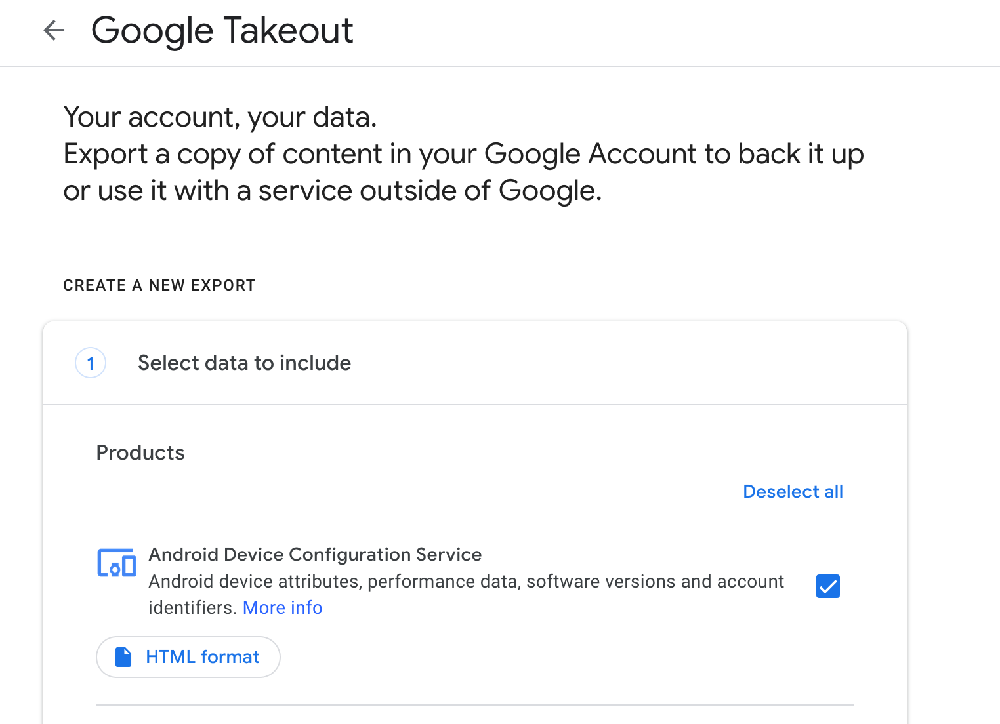
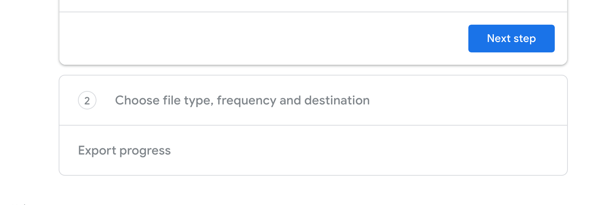
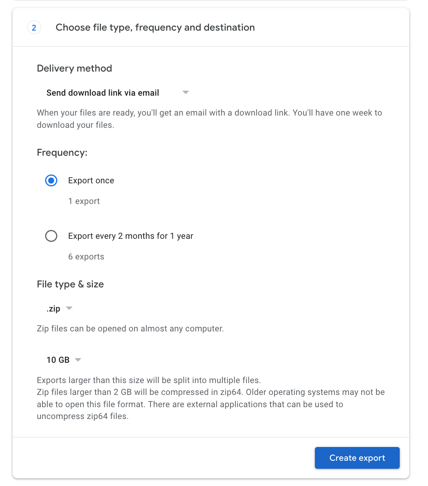

# Google

* Navigate to [https://takeout.google.com/](https://takeout.google.com/)
* Sign in with your Google account \(if required\) 
* Post sign-in, review the _Create A New Export_ form

* Review the Products you want to export and then select _Next Step_

* Review file type and other backup settings and then click the _Create Export_ button 

* Google will start creating an export of all your data and will notify you via email when it is ready. 

